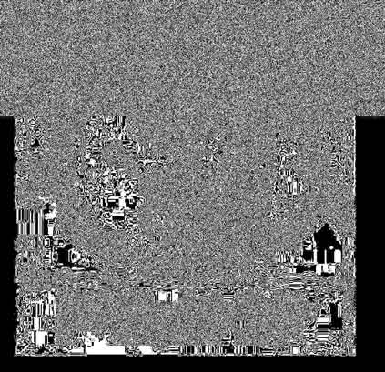

[TOC]

# Misc

## 隐写题-答题思路
3. flag逆向提交下试试
1. 解题提示.md
2. 八卦，其他不知道的，2种数据往二进制上碰
1. 先看题目, 根据题目搜索关键字 2.  按提示转base64搜，末尾字符搜，多处合并 3. 附件的文件名
2. 文件名逆向
       文件名12121, 拆分 12 121或者  121 21, ascii码和顺序位置
2. 1.搜文件名， 搜 <文件名> 下载
2. 文件属性-详细信息 ，各种奇怪的数据，加转码。
3. 010editor, 
        搜索Text型, flag,ctf, Unicode型 flag
        看文件头 
        修复文件头
        看文件末尾
        看文件中间
3. 打开看文件内容
4. 文件异常：高度，宽度是否正常。
0. 7z解压, 不要光用winrar
0. foremost file
0. binwalk -e filename
0. binwalk -Me filename | 嵌套处理
        * 发现多文件？看每个文件尾有没有隐藏
        * tiff data, 用 Stegano_Stegsolve的 frame browser
        * 有zlib 可能需要 LSB, RGB 加密等，用Stegano_Stegsolve各种尝试。
        * binwalk file
        *    发现 zlib文件 使用 binwalk -e file, 解压出29d 29d.zlib
        *    file 29d, 发现是 data 再次 binwalk 29d
        *    发现 zlib文件 再次 binwalk -e 解压出aad
        *    file aad, 发现是文本 打开查看

7. 010editor 分析, 配合 dd命令 分离，或者直接010 editor中分离
    
        010editor 搜索 `\{[a-z\d]{4,}`, 选项勾上 Regular expression
        strings xiaojiejie.jpeg | grep -E "\{[a-z]{4,}"
        grep 'KEY' -a filename

1. 词频分析 - 一堆字母的时候
1. LSB隐写 -- LSBsteg.py decode -i 1.png -o flag.zip
1. 零宽隐写200c,200b,200d
            Unicode Steganography with Zero-Width Characters.rar
            用set来看看有哪些字符 
            也可能是文件。
1. 文字隐写 
           -- SNOW
           -- TTL隐写 2进制前2位变化 [SWPU2019]Network ,63/127/191/255
           -- 用sublime查看  是否有0宽隐写
           -- 单词拼写错误可能是key,   https://github.com/first20hours/google-10000-english/blob/master/google-10000-english.txt
8. GIF文件：stegsolve 按帧看
8. 双图考虑进行盲水印，并且根据题目，设置alpha为10,  blindWaterMark
       python3 bwmforpy3.py decode 00001537.png 00001404.jpg flag.png --alpha 10
9. pdf文件: chrome打开全选复制出来看看
10.pdf/bmp隐写： wbs43open
8. 图片修复: 
         二维码修复 https://merricx.github.io/qrazybox/

8. 图片隐写: 查看怪异的地方（比如奇怪直线，点），
           1.RGB分析。
           2.绿色有异常，提取全部绿色通道
        
8. PNG文件：
        1.windows照片查看器看，会忽略crc检验。
        2.用其他查看器。看会不会报错, 说明修改了高度
8. PNG文件：调整下高度，看看有没有flag。
8. PNG文件：改了宽度。暴破下过CRC32验证 , 10h-14h是宽度，大端写入比如1写为 00 00 00 1
8. PNG文件：`zsteg pcat.png`
             --- b1,r,lsb,xy   对应 lsb, red0, 不确定
             --- b1,bgr,lsb,xy 对应 Bit Plan Order: BGR, 勾了r0g0b0
             提取文件 zsteg -E "b1,bgr,lsb,xy"  flag.png>flag.pcap

9. 图片藏文件: stegsolve, r0g0b0勾上, RGB, GBR等每个试一次, 下面就是藏了信息。


1. JPEG隐写 提示JPSH, Jphswin, 打开后点seek保存文件
8. 图片隐写: Exif信息
8. 图片信息 经纬度
8. 图片隐写 stegsolve 左右看通道信息

        Alpha通道: 透明-看得到图，不透明看不到图, 其他-有隐藏信息
        R通道: 最低为位有问题。，把rgb 的0通道都提取出来。
        多通道有信息时，保存为Alpha0, r0,g0,b0图, Alpha0分别和+r0, 进行 Analyze - Image combine, 再用Alpha0和g0 ,b0同操作
        脚本像素分离看信息


8. 图片隐写 stegsolve 看下lsb隐写, 
        
8. 图片隐写 Steghide 看下有没有隐写。 steghide extract -sf filename
10. 密码相关, steghide尝试密码123456
10. 图片隐写 outguess -k 密码 -r 需要破解的文件名 -t 转出的文件名
            outguess -k gemlove -r sheng_huo_zhao_zhao.jpg -t flag.txt
10. 图片隐写 2进制的拼图,用010editor或winhex看形状。
10. 图片隐写 提示 刷新/F5, 使用F5-steganography
10. 图片隐写 Image Steganography
10. 图片隐写 彩图提取二维码。stegsolve选一适合的黑白帧。调整大小/去取某通道某 bit 信息/随机上色/etc. 都行。
        
    11. 或者[BJDCTF#bincat2](http://www.fzwjscj.xyz/index.php/archives/30/#bincat2)，对比两小图的区别，然后循环大图对比指定偏移量。
11. 音频隐写 https://www.sqlsec.com/2018/01/ctfwav.html
12.         1.Audition/Audacity看 多是摩斯码, 2.看频谱spectrogram(视图-频谱) 3.听歌
            效果-反向 听声音。
            删除多余文件头，可能有2段riff
            MP3Stego: decode.exe -X target.mp3
                      decode.exe -P password -X target.mp3
                      decode.exe -P pass -X target.mp3
                      decode.exe -P 主办单位 -X target.mp3
            摩斯码音频 自动解码： 
                    1.Audition禁用 其他声道, 将目标声道提高 
                    2.右击声道，提取为单声道， 导出mp3
                    3. https://morsecode.world/international/decoder/audio-decoder-adaptive.html 上传解码 play
            SilentEye

            
11. 文字隐写 snow可Google:space tab steg, baidu: 空格 制表符 隐写
11. 文字隐写 snow.exe -C flag.txt
12.         base64隐写
10. 脑洞信息 图片是倒着的, dragon倒过来就是 nogard
10. 脑洞信息 galf_si_erehw 提示: 可能是将hex数据倒转过来
11. 看hex值符合哪些特点，倒序 | 文件头 |
11. Detect it Easy 查看, 见下面的具体用法
10. pcapng 取证： 1. foremost分解看看。 2. 用bytes搜索pass, flag 3. 追踪流 4.见底下详解
11. zip 伪加密, ZipCenOp.jar r filename
11. rar 伪加密, F9 81 74 85 改成 F9 81 74 80
11. zip/rar 文件， 使用unzip或者winrar打开 逐个解压，因为包里可能有不需要密码的。
11. zip/rar 密码，先看题目提示，图片文件用010 editor搜索设置 Unicode型, 搜pass, 4位试下。不行再看总结。
11. zip/rar 密码爆破, 可见字符1-6位, 开始字符0
11. zip/rar 明文攻击, 里面文件有可能是网上有的。搜一下下载个进行明文攻击。
                压缩工具要相同，如果产生CRC32不同。换工具试， 算法也要相同
                1.压缩方式要选 1存储 2zip
                pkcrack.exe -C 1.zip -c hhh.jpg -P 2.zip -p hhh.jpg -d re.zip -a
                Advanced Archive Password Recovery 比上面慢。
                     提示尝试找回口令的时候---停止。然后用3个密钥解密。
            小文件爆破 (原始)大小 <=6 可以考虑CRC32爆破攻击
                      python crc32.py reverse 0x1b2e6194
11. doc文件 1. 显示隐藏文字 2. 解压看有没有隐藏图片
12. cap文件, 802.11协议的数据包  aircrack-ng shipin.cap 见底下
12. 01001010 等二进制转字符串试试。
13. xor文件 xortools破解。见下面
14. hex文件 IDA分析, 或 xxd -r -p MissionImprobable.TEENSY31.hex out
14. 内存分析|文件分析
            让文件根据日期排序。再分析

13. 路由相关使用 routerpassview 搜 username 或者是password
15. vmdk 一定要在Linux下7z解压: __7z x filename__
16. 查找webshell, 使用D盾审计。
17. 视频文件, Premiere看比较清楚。
18. 视频隐写 ->图片, ffmpeg -i 10.mp4 -an -f image2 outut_%05d.jpg
19. 编码问题 -- 1. 010 editor左上角 edit as 处修改
           -- 2. dd conv=ascii if=111.txt of=ASCII_file.txt

21. curl下载分段文件   `curl -H "Range: bytes=6291450000-" --output /dev/stdout` 天翼杯2020_wp_by_LQers签到

20. blog,gitee等信息 1.直接在后面加关键文件访问，2.看所有提交分支。有没有其他文件。
18. sage 解方程，二元一次，一元多次方程，见下面
19. nfs流  notepad 1.txt:flag.txt 或用 NtfsStreamsEditor
20. 离线词频分析 https://www.cnpython.com/pypi/symspellp https://github.com/reneklacan/symspell/blob/master/data/frequency_dictionary_en_82_765.txt
19. 太空站文件 了慢扫描图像工具：MMSSTV https://hamsoft.ca/pages/mmsstv.php
10. 脑洞信息 颜色*宽度 求和,
10. 脑洞信息 6-10位数字 可能是QQ号，进它空间，相册看下。
11. 

### 流量分析题
流量分析 icmp, 长度转ascii码, 见下面 简单流量分析
文件-导出-http所有
TLS解密： keylog.txt --编辑-首选项-协议-TLS, Master-Secret log filename 选择keylog.txt
         见Software用Wireshark轻松解密TLS浏览器流量

看post请求, 看参数, 参数大小，计算是否有tcp头见misc_fly.pcap
去掉异常头部(比如1-4个字符)
    binwalk file或通过请求参数看总大小a，合并文件b , b-a再除以(包数量)=tcp头。见misc_fly.pcap
TCP数据包看16进制  data, hex值可能有按键操作7F是DEL键
注意盲注等Sql关键字。可能有flag
蚁剑混淆 f389等等会加在Base64前面，逐位去混淆。，自己搭建抓包试下。
USB 流量分析 见羊城杯2021 misc520, unctf2020 mouse_click
求路径找  system('pwd');
www默认用户可能是 www-data
流量加密base64，去掉前面几个字符解码（此处是2个），解完为fprc
      Value: FBL3Zhci93d3cvaHRtbC9mcnBjLmluaQ==
      即 L3Zhci93d3cvaHRtbC9mcnBjLmluaQ==
攻击的ip地址等信息 可能保存在.ini文件中
查找文件: 注意desktop下的文件

__解密流量__
方式 1
airdecap-ng 客户端.cap -e My_Wifi -p 233@114514_qwe
airdecap-ng 客户端.cap -e [essid] -p [password]
方式2
Wireshark, 设置方法：编辑-首选项-Protocols-IEEE 802.11-Edit,设置好后点击ok，就可以看到解密的流量包了

哥斯拉马流量有混淆 -- 2021陇剑杯wifi
使用了xor_base64的加密器 前后各附加了16位的混淆字符，所以我们拿到的流量要先删除前16位和后16位字符

## png隐写

    00 00 00 0D 49 48 44 52 --0D头块长13, 49 48 44 52 IHDR标识
    00 00 01 f4 00 00 01 a4  宽:00 00 01 f4即500 高: 00 00 01 a4即 400
    08 06 00 00 00 cb d6 df 8a --- CRC校验 29:32 这4个字节是CRC

有时会改宽度，需要CRC校验的。

0x12,13 宽度, 大端模式, 999为03e7

0x16,17 高度

左上角为基点分别是向右拉和向下。宽度一般不会改，会进行CRC校验的。

pngcheck -v filename

Image photography线上和离线加密方式不同。

### png格式介绍1
参考链接

https://dev.gameres.com/Program/Visual/Other/PNGFormat.htm

https://blog.csdn.net/hherima/article/details/45847043

https://www.bilibili.com/video/BV1V4411Z7VA

00|01|02|03|04|05|06|07|08|09|0A|0B|0C|0D|0E|0F
--|--|--|--|--|--|--|--|--|--|--|--|--|--|--|--
89|50|4E|47|0D|0A|1A|0A|00|00|00|0D|49|48|44|52
00|00|00|0F|00|00|00|20|08|06|00|00|00|CD|2C|22
宽度1/4|2/4|3/4|4/4|高度1/4|2/4|3/4|4/4|Bit depth|ColorType|Compression Method|Filter method|Interlace Method|crc 1/4|2/4|3/4
A9 |
4/4|

### png格式介绍2

    89 50 4E 47 0D 0A 1A 0A 00 00 00 0D 49 48 44 52
    00 00 07 80 00 00 04 B0 

前四个字节00 00 00 0D（即为十进制的13）代表数据块的长度为13，数据块包含了png图片的宽高等信息，该段格式是固定的

之后的四个字节49 48 44 52（即为ASCII码的IHDR）是文件头数据块的标示，该段格式也是固定的

之后进入13位数据块，前8个字节00 00 05 56 00 00 03 00中：

前四个字节00 00 05 56（即为十进制的1366），代表该图片的宽，该段数据是由图片的实际宽决定的

后四个字节00 00 03 00（即为十进制的768），代表该图片的高，该段数据是由图片的实际高度决定的

这8个字节都属于13位数据块的内容，因此数据块应再向后数5个字节，即为00 00 05 56 00 00 03 00 08 02 00 00 00

剩余的4位40 5C AB 95为该png的CRC检验码，也就是本篇文章要重点讨论的地方，该段数据是由IDCH以及十三位数据块（即上文中的49 48 44 52 00 00 05 56 00 00 03 00 08 02 00 00 00）计算得到的
### 17 steghide隐写01\
将Misc.png拖入winhex发现尾部不对。
1. 用foremost 解压 Misc.png
2. 用steghide 解密 000112.jpg，出现密码
3. 打开pdf，输入密码。（或者暴破）

### 19 outguess隐写
outguess -r angrybird.jpg 11.txt

# 工具使用

## wifi.cap wifi密码破解 aircrack, airdecap-ng

    aircrack-ng -w 常用密码.txt wifi.cap
    aircrack-ng -w /usr/share/wordlists/rockyou.txt wifi.cap

解密流量包

    airdecap-ng shipin.cap -e 0719 -p 88888888
    airdecap-ng shipin.cap -e 0719(前面的essid) -p 88888888
### 解密 http 包, misc_fly.pcap

过滤语句 http.request.method==POST 找到压缩包分卷每个进行保存。

binwalk分析一下 发现有一个rar压缩包 364应该是数据包的一些头等等全部去掉。

    dd if=a1 bs=1 skip=364 of=b1
    dd if=a2 bs=1 skip=364 of=b2
    dd if=a3 bs=1 skip=364 of=b3
    dd if=a4 bs=1 skip=364 of=b4
    dd if=a5 bs=1 skip=364 of=b5
    cat b1 b2 b3 b4 b5 > fly.rar

参考 https://www.cnblogs.com/cat47/p/11567399.html

https://blog.csdn.net/sinat_36188088/article/details/53333565
## notepad++
二进制转字符-转10进制

## binwalk -- kali 分析文件工具 分析头和尾
binwalk -e new.jpg

-e = extract 直接解压文件

\u1111\u2222 --- 要在Chrome里直接 F12 console加引号输出 , "\u1111\u2222" 回车。

## foremost -- kali 分析文件工具,并拆分隐藏的文件
[windows上使用foremost](https://www.cnblogs.com/cnnnnnn/p/8994362.html)

foremost new.jpg 

## Stegsolve --- LSB隐写
java -jar Stegsolve.jar

Analasys - Data Extract

最低位先用0 (alpha没变形没选)

√LSB First

测试每个 Bit Plane Order

      找到明显标志后保存 - Save Test 

SaveBin

## zsteg
zsteg -h

    # 查看LSB信息
    zsteg pcat.png

    检测zlib
    # -b的位数是从1开始的
    zsteg zlib.bmp -b 1 -o xy -v

## file 命令分析文件 或者winhex

## volatility 内存取证
https://blog.csdn.net/qq_42880719/article/details/117304586

`volatility -f <文件名> --profile=<配置文件> <插件> [插件参数]`

imageinfo

```
volatility -f raw.raw imageinfo
```

pslist 知道镜像信息后，一般就会pslist 查看镜像中正在运行的进程

```
volatility -f raw.raw --profile=Win7SP1x64 pslist
# 查看搜索历史
volatility -f raw.raw --profile=Win7SP1x64 iehistory
```

lsadump 查看最后登录的用户

```
volatility -f raw.raw --profile=Win7SP1x64 lsadump
```

pstree 以树的形式来列出正在进行的进程，当然pstree也不会显示出隐藏或未链接的进程

`volatility -f raw.raw --profile=Win7SP1x64 pslist`

cmdscan 搜索XP / 2003 / Vista / 2008和conhost.exe上搜索csrss.exe的内存，对于win7是搜索cmd.exe。是搜索命令行的输入历史记录

```
volatility -f raw.raw --profile=Win7SP1x64 cmdscan
```

consoles 相似与cmdscan，但是他扫描的不是COMMAND_HISTORY，而是CONSOLE_INFORMATION，而且还有个显著的优点是cmdscan只能查看到输入的指令，而consoles能查看到输入的指令以及缓冲区的输出(即键入和键出)

```
volatility -f raw.raw --profile=Win7SP1x64 consoles
```

cmdline 此指令将会列出所有命令行下运行的程序

```
volatility -f raw.raw --profile=Win7SP1x64 cmdline
```

除此之外，简单讲一些不常见的指令

```
privs:显示进程权限
envars：显示进程环境变量
verinfo：显示PE文件中嵌入的版本信息
enumfunc：列出进程，dll和内核驱动程序导入和导出
```

filescan 扫描文件指令,一般呢会根据正在进行的进程来定向扫描，也常常会扫描桌面文件。

```
volatility -f raw.raw --profile=Win7SP1x64 filescan
volatility -f raw.raw --profile=Win7SP1x64 filescan | grep "flag"
volatility -f raw.raw --profile=Win7SP1x64 filescan | grep "Desktop"（有的可能是中文把Desktop改成桌面即可）
volatility -f raw.raw --profile=Win7SP1x64 filescan | grep -E "png"（查找png后缀文件）
```

dumpfiles dump出指定PID的文件，一般只要是做内存题都会用到的指令。

```
volatility -f raw.raw --profile=Win7SP1x64 dumpfiles -Q [PID] -D ./
volatility -f 内存镜像.dd --profile=WinXPSP2x86 memdump -p [PID] -D [dump 出的文件保存的目录]     # 内存中提取
volatility -f 内存镜像.dd --profile=WinXPSP2x86 procdump -p [PID] -D [dump 出的文件保存的目录]    # 进程中提取
```
将PID的文件保存在当前目录

memdump 可以将内存中的某个进程保存出来

volatility -f win7.vmem --profile=Win7SP1x64 memdump -p [PID] -D ./

editbox/notepad
显示出有关编辑控件的信息
在XP中，正在运行的notepad程序，使用notepad指令就可以看到notepad.exe的内容，而在win7中，将不支持notepad，只能使用editbox，这里举例editbox

volatility -f raw.raw --profile=Win7SP1x64 editbox

netscan
查看网络连接的连接情况

volatility -f raw.raw --profile=Win7SP1x64 netscan

svcscan
扫描windows服务列表

volatility -f raw.raw --profile=Win7SP1x64 svcscan

screenshot
显示GDI样式的截屏

volatility -f raw.raw --profile=Win7SP1x64 screenshot -D ./

userassist
查看运行的进程和次数

volatility -f raw.raw --profile=Win7SP1x64 userassist

clipboard
剪贴板数据，加参数-v可以导出

volatility -f raw.raw --profile=Win7SP1x64 clipboard
volatility -f raw.raw --profile=Win7SP1x64 clipboard -v >clip.txt


hivelist
列出注册表

volatility -f raw.raw --profile=Win7SP1x64 hivelist
加参数-o virtual地址可以导出，如volatility -f raw.raw --profile=Win7SP1x64 hivelist -o 0xfffff8a003696010

iehistory
获取浏览器的浏览历史，这个指令也经常用到。

volatility -f raw.raw --profile=Win7SP1x64 iehistory


dlldump
将指定PID的进程的所有DLL导出

volatility -f raw.raw --profile=Win7SP1x64 dlldump -p [PID] -D ./


printkey
常常是用来列举用户及密码、查看获取最后登陆系统的用户。

获取用户：volatility -f raw.raw --profile=Win7SP1x64 printkey -K "SAM\Domains\Account\Users\Names"

获取最后登陆系统的用户：volatility -f raw.raw --profile=Win7SP1x64 printkey -K “SOFTWARE\Microsoft\Windows NT\CurrentVersion\Winlogon”


获取密码哈希：
1.获取system 的 virtual 地址，SAM 的 virtual 地址：
volatility -f raw.raw --profile=Win7SP1x64 hivelist

获取内存中的系统密码，我们可以使用 hashdump 将它提取出来 。

    volatility -f mem.vmem –profile=WinXPSP2x86 hashdump -y 0xe1035b60 -s 0xe16aab60 

2.hashdump:
volatility -f raw.raw --profile=Win7SP1x64 hashdump -y 0xfffff8a000024010 -s 0xfffff8a001390010
volatility -f raw.raw --profile=Win7SP1x64 hashdump -y （注册表 system 的 virtual 地址 ）-s （SAM 的 virtual 地址）


>3.碰运气解hash(一般题都是能用cmd5、somd5解出来的)

配合Gimp
dump出正在运行的内存，然后配合Gimp

1.dump出正在运行的程序，随便dump都行
volatility -f raw.raw --profile=Win7SP1x64 memdump -p [PID] -D ./
2.将dump出来的文件(如1234.dmp)重命名为.data拓展名(即1234.data)
3.使用Gimp打开(ubuntu)

>4.这里请放大，进行如下操作
(1).将图像类型RGB修改为RGB Alpha
(2).调整高度(建议调稍微高一点)、确定一个看着合适的宽度、调整位移，可以使用鼠标滑轮和键盘来快速调整，也可以拖动调整


查找txt文件
```
volatility -f 1.raw --profile=WinXPSP2x86 filescan|grep "txt"
```

获取–profile的参数 

    volatility -f mem.vmem –profile=WinXPSP2x86 volshell

shell的命令： 

    dt("内核关键数据结构名称")
    如
    dt("_PEB")

剪贴板
    
    volatility -f memeories.vmem --profile=Win10x86_14393 clipboard

列举进程：

    volatility -f mem.vmem –profile=WinXPSP2x86 pslist

列举缓存在内存的注册表 ：

    volatility -f mem.vmem –profile=WinXPSP2x86 hivelist

hivedump 打印出注册表中的数据 ：

    volatility -f mem.vmem –profile=WinXPSP2x86 hivedump -o 注册表的 virtual 地址

获取SAM表中的用户 ：

    volatility -f mem.vmem –profile=WinXPSP2x86 printkey -K "SAM\Domains\Account\Users\Names" 

可以看到有4个用户

获取最后登录系统的账户 ：

    volatility -f mem.vmem –profile=WinXPSP2x86 printkey -K "SOFTWARE\Microsoft\Windows NT\CurrentVersion\Winlogon" 

提取出内存中记录的 当时正在运行的程序有哪些，运行过多少次，最后一次运行的时间等信息 

    volatility -f mem.vmem –profile=WinXPSP2x86 userassist

将内存中的某个进程数据以 dmp 的格式保存出来 。

    volatility -f mem.vmem –profile=WinXPSP2x86 -p [PID] -D [dump 出的文件保存的目录]

二进制编辑器 hexeditor 将以上保存的 dmp 文件打开，并进行调查取证的工作 。

    hexeditor 1736.dmp

二进制.png

你还可以使用 strings 这个工具将它的字符串打印出来。 

    例：

    strings 1736.dmp > 1736.txt 

    strings 1608.dmp > 1736.txt | grep shellcode 

提取内存中保留的 cmd 命令使用情况 。

    volatility -f mem.vmem –profile=WinXPSP2x86 cmdscan

获取到当时的网络连接情况 。

    volatility -f mem.vmem –profile=WinXPSP2x86 netscan

获取 IE 浏览器的使用情况。 

    volatility -f mem.vmem –profile=WinXPSP2x86 iehistory 


最大程度上将内存中的信息提取出来，那么你可以使用 timeliner 这个插件。它会从多个位置来收集系统的活动信息 

    volatility -f mem.vmem –profile=WinXPSP2x86 timeliner


打开kali，使用volatility 查看进程，可以发现一个TrueCrypy.exe的进程。 

    volatility -f mem.vmem –profile=WinXPSP2x86 pslist

TrueCrypy.exe是一款加密程序，而我们可以推出，suspicion为加密的结果。 

我们需要从内存dump出key来。 

    volatility -f mem.vmem –profile=WinXPSP2x86 memdump -p 1464 -D ctf/ 

dump出来的文件为1464.dmp 。

Elcomsoft Forensic Disk Decryptor 的使用。

我们需要借助Elcomsoft Forensic Disk Decryptor（Elcomsoft硬盘取证解密器，简称为EFDD）软件来获取key和破解文件  。

### volatility3
2,3命令表
https://book.hacktricks.xyz/forensics/basic-forensic-methodology/memory-dump-analysis/volatility-examples

Volatility3和Volatility2用法差不多，但不需要指定profile。只是插件调用方式改变，特定的操作系统有特定的插件。

python3 vol.py [plugin] -f [image]

python3 vol.py -f ../raw.raw windows.info

```python

常用插件：
    layerwriter ：列出内存镜像platform信息
    linux.bash ：从内存中恢复bash命令历史记录
    linux.check_afinfo ：验证网络协议的操作功能指针
    linux.check_syscall ：检查系统调用表中的挂钩
    linux.elfs ：列出所有进程的所有内存映射ELF文件
    linux.lsmod ：列出加载的内核模块
    linux.lsof ：列出所有进程的所有内存映射
    linux.malfind ：列出可能包含注入代码的进程内存范围
    linux.proc ：列出所有进程的所有内存映射
    linux.pslist ：列出linux内存映像中存在的进程
    linux.pstree ：列出进程树
    mac.bash ：从内存中恢复bash命令历史记录
    mac.check_syscall ：检查系统调用表中的挂钩
    mac.check_sysctl ：检查sysctl处理程序的挂钩
    mac.check_trap_table ：检查trap表中的挂钩
    mac.ifconfig ：列出网卡信息
    mac.lsmod ：列出加载的内核模块
    mac.lsof ：列出所有进程的所有内存映射
    mac.malfind ：列出可能包含注入代码的进程内存范围
    mac.netstat ：列出所有进程的所有网络连接
    mac.psaux ：恢复程序命令行参数
    mac.pslist ：列出linux内存映像中存在的进程
    mac.pstree ：列出进程树
    mac.tasks ：列出Mac内存映像中存在的进程
    windows.info ：显示正在分析的内存样本的OS和内核详细信息
    windows.callbacks ：列出内核回调和通知例程
    windows.cmdline ：列出进程命令行参数
    windows.dlldump ：将进程内存范围DLL转储
    windows.dlllist ：列出Windows内存映像中已加载的dll模块
    windows.driverirp ：在Windows内存映像中列出驱动程序的IRP
    windows.driverscan ：扫描Windows内存映像中存在的驱动程序
    windows.filescan ：扫描Windows内存映像中存在的文件对象
    windows.handles ：列出进程打开的句柄
    windows.malfind ：列出可能包含注入代码的进程内存范围
    windows.moddump ：转储内核模块
    windows.modscan ：扫描Windows内存映像中存在的模块
    windows.mutantscan ：扫描Windows内存映像中存在的互斥锁
    windows.pslist ：列出Windows内存映像中存在的进程
    windows.psscan ：扫描Windows内存映像中存在的进程
    windows.pstree ：列出进程树
    windows.procdump ：转储处理可执行映像
    windows.registry.certificates ：列出注册表中存储的证书
    windows.registry.hivelist ：列出内存映像中存在的注册表配置单元
    windows.registry.hivescan ：扫描Windows内存映像中存在的注册表配置单元
    windows.registry.printkey ：在配置单元或特定键值下列出注册表项
    windows.registry.userassist ：打印用户助手注册表项和信息
    windows.ssdt ：列出系统调用表
    windows.strings ：读取字符串命令的输出，并指示每个字符串属于哪个进程
    windows.svcscan ：扫描Windows服务
    windows.symlinkscan ：扫描Windows内存映像中存在的链接
```
### 各种插件

```
Plugins
-------
amcache                    - Print AmCache information
apihooks                   - Detect API hooks in process and kernel memory
atoms                      - Print session and window station atom tables
atomscan                   - Pool scanner for atom tables
auditpol                   - Prints out the Audit Policies from HKLM\SECURITY\Policy\PolAdtEv
bigpools                   - Dump the big page pools using BigPagePoolScanner
bioskbd                    - Reads the keyboard buffer from Real Mode memory
cachedump                  - Dumps cached domain hashes from memory
callbacks                  - Print system-wide notification routines
clipboard                  - Extract the contents of the windows clipboard
cmdline                    - Display process command-line arguments
cmdscan                    - Extract command history by scanning for _COMMAND_HISTORY
connections                - Print list of open connections [Windows XP and 2003 Only]
connscan                   - Pool scanner for tcp connections
consoles                   - Extract command history by scanning for _CONSOLE_INFORMATION
crashinfo                  - Dump crash-dump information
deskscan                   - Poolscaner for tagDESKTOP (desktops)
devicetree                 - Show device tree
dlldump                    - Dump DLLs from a process address space
dlllist                    - Print list of loaded dlls for each process
driverirp                  - Driver IRP hook detection
drivermodule               - Associate driver objects to kernel modules
driverscan                 - Pool scanner for driver objects
dumpcerts                  - Dump RSA private and public SSL keys
dumpfiles                  - Extract memory mapped and cached files
dumpregistry               - Dumps registry files out to disk
editbox                    - Displays information about Edit controls. (Listbox experimental.)
envars                     - Display process environment variables
eventhooks                 - Print details on windows event hooks
evtlogs                    - Extract Windows Event Logs (XP/2003 only)
filescan                   - Pool scanner for file objects
gahti                      - Dump the USER handle type information
gditimers                  - Print installed GDI timers and callbacks
gdt                        - Display Global Descriptor Table
getservicesids             - Get the names of services in the Registry and return Calculated SID
getsids                    - Print the SIDs owning each process
handles                    - Print list of open handles for each process
hashdump                   - Dumps passwords hashes (LM/NTLM) from memory
hibinfo                    - Dump hibernation file information
hivedump                   - Prints out a hive
hivelist                   - Print list of registry hives.
hivescan                   - Pool scanner for registry hives
hpakextract                - Extract physical memory from an HPAK file
hpakinfo                   - Info on an HPAK file
idt                        - Display Interrupt Descriptor Table
iehistory                  - Reconstruct Internet Explorer cache / history
imagecopy                  - Copies a physical address space out as a raw DD image
imageinfo                  - Identify information for the image
impscan                    - Scan for calls to imported functions
joblinks                   - Print process job link information
kdbgscan                   - Search for and dump potential KDBG values
kpcrscan                   - Search for and dump potential KPCR values
ldrmodules                 - Detect unlinked DLLs
limeinfo                   - Dump Lime file format information
linux_apihooks             - Checks for userland apihooks
linux_arp                  - Print the ARP table
linux_aslr_shift           - Automatically detect the Linux ASLR shift
linux_banner               - Prints the Linux banner information
linux_bash                 - Recover bash history from bash process memory
linux_bash_env             - Recover a process' dynamic environment variables
linux_bash_hash            - Recover bash hash table from bash process memory
linux_check_afinfo         - Verifies the operation function pointers of network protocols
linux_check_creds          - Checks if any processes are sharing credential structures
linux_check_evt_arm        - Checks the Exception Vector Table to look for syscall table hooking
linux_check_fop            - Check file operation structures for rootkit modifications
linux_check_idt            - Checks if the IDT has been altered
linux_check_inline_kernel  - Check for inline kernel hooks
linux_check_modules        - Compares module list to sysfs info, if available
linux_check_syscall        - Checks if the system call table has been altered
linux_check_syscall_arm    - Checks if the system call table has been altered
linux_check_tty            - Checks tty devices for hooks
linux_cpuinfo              - Prints info about each active processor
linux_dentry_cache         - Gather files from the dentry cache
linux_dmesg                - Gather dmesg buffer
linux_dump_map             - Writes selected memory mappings to disk
linux_dynamic_env          - Recover a process' dynamic environment variables
linux_elfs                 - Find ELF binaries in process mappings
linux_enumerate_files      - Lists files referenced by the filesystem cache
linux_find_file            - Lists and recovers files from memory
linux_getcwd               - Lists current working directory of each process
linux_hidden_modules       - Carves memory to find hidden kernel modules
linux_ifconfig             - Gathers active interfaces
linux_info_regs            - It's like 'info registers' in GDB. It prints out all the
linux_iomem                - Provides output similar to /proc/iomem
linux_kernel_opened_files  - Lists files that are opened from within the kernel
linux_keyboard_notifiers   - Parses the keyboard notifier call chain
linux_ldrmodules           - Compares the output of proc maps with the list of libraries from libdl
linux_library_list         - Lists libraries loaded into a process
linux_librarydump          - Dumps shared libraries in process memory to disk
linux_list_raw             - List applications with promiscuous sockets
linux_lsmod                - Gather loaded kernel modules
linux_lsof                 - Lists file descriptors and their path
linux_malfind              - Looks for suspicious process mappings
linux_memmap               - Dumps the memory map for linux tasks
linux_moddump              - Extract loaded kernel modules
linux_mount                - Gather mounted fs/devices
linux_mount_cache          - Gather mounted fs/devices from kmem_cache
linux_netfilter            - Lists Netfilter hooks
linux_netscan              - Carves for network connection structures
linux_netstat              - Lists open sockets
linux_pidhashtable         - Enumerates processes through the PID hash table
linux_pkt_queues           - Writes per-process packet queues out to disk
linux_plthook              - Scan ELF binaries' PLT for hooks to non-NEEDED images
linux_proc_maps            - Gathers process memory maps
linux_proc_maps_rb         - Gathers process maps for linux through the mappings red-black tree
linux_procdump             - Dumps a process's executable image to disk
linux_process_hollow       - Checks for signs of process hollowing
linux_psaux                - Gathers processes along with full command line and start time
linux_psenv                - Gathers processes along with their static environment variables
linux_pslist               - Gather active tasks by walking the task_struct->task list
linux_pslist_cache         - Gather tasks from the kmem_cache
linux_psscan               - Scan physical memory for processes
linux_pstree               - Shows the parent/child relationship between processes
linux_psxview              - Find hidden processes with various process listings
linux_recover_filesystem   - Recovers the entire cached file system from memory
linux_route_cache          - Recovers the routing cache from memory
linux_sk_buff_cache        - Recovers packets from the sk_buff kmem_cache
linux_slabinfo             - Mimics /proc/slabinfo on a running machine
linux_strings              - Match physical offsets to virtual addresses (may take a while, VERY verbose)
linux_threads              - Prints threads of processes
linux_tmpfs                - Recovers tmpfs filesystems from memory
linux_truecrypt_passphrase - Recovers cached Truecrypt passphrases
linux_vma_cache            - Gather VMAs from the vm_area_struct cache
linux_volshell             - Shell in the memory image
linux_yarascan             - A shell in the Linux memory image
lsadump                    - Dump (decrypted) LSA secrets from the registry
mac_adium                  - Lists Adium messages
mac_apihooks               - Checks for API hooks in processes
mac_apihooks_kernel        - Checks to see if system call and kernel functions are hooked
mac_arp                    - Prints the arp table
mac_bash                   - Recover bash history from bash process memory
mac_bash_env               - Recover bash's environment variables
mac_bash_hash              - Recover bash hash table from bash process memory
mac_calendar               - Gets calendar events from Calendar.app
mac_check_fop              - Validate File Operation Pointers
mac_check_mig_table        - Lists entires in the kernel's MIG table
mac_check_syscall_shadow   - Looks for shadow system call tables
mac_check_syscalls         - Checks to see if system call table entries are hooked
mac_check_sysctl           - Checks for unknown sysctl handlers
mac_check_trap_table       - Checks to see if mach trap table entries are hooked
mac_compressed_swap        - Prints Mac OS X VM compressor stats and dumps all compressed pages
mac_contacts               - Gets contact names from Contacts.app
mac_dead_procs             - Prints terminated/de-allocated processes
mac_dead_sockets           - Prints terminated/de-allocated network sockets
mac_dead_vnodes            - Lists freed vnode structures
mac_devfs                  - Lists files in the file cache
mac_dmesg                  - Prints the kernel debug buffer
mac_dump_file              - Dumps a specified file
mac_dump_maps              - Dumps memory ranges of process(es), optionally including pages in compressed swap
mac_dyld_maps              - Gets memory maps of processes from dyld data structures
mac_find_aslr_shift        - Find the ASLR shift value for 10.8+ images
mac_get_profile            - Automatically detect Mac profiles
mac_ifconfig               - Lists network interface information for all devices
mac_interest_handlers      - Lists IOKit Interest Handlers
mac_ip_filters             - Reports any hooked IP filters
mac_kernel_classes         - Lists loaded c++ classes in the kernel
mac_kevents                - Show parent/child relationship of processes
mac_keychaindump           - Recovers possbile keychain keys. Use chainbreaker to open related keychain files
mac_ldrmodules             - Compares the output of proc maps with the list of libraries from libdl
mac_librarydump            - Dumps the executable of a process
mac_list_files             - Lists files in the file cache
mac_list_kauth_listeners   - Lists Kauth Scope listeners
mac_list_kauth_scopes      - Lists Kauth Scopes and their status
mac_list_raw               - List applications with promiscuous sockets
mac_list_sessions          - Enumerates sessions
mac_list_zones             - Prints active zones
mac_lsmod                  - Lists loaded kernel modules
mac_lsmod_iokit            - Lists loaded kernel modules through IOkit
mac_lsmod_kext_map         - Lists loaded kernel modules
mac_lsof                   - Lists per-process opened files
mac_machine_info           - Prints machine information about the sample
mac_malfind                - Looks for suspicious process mappings
mac_memdump                - Dump addressable memory pages to a file
mac_moddump                - Writes the specified kernel extension to disk
mac_mount                  - Prints mounted device information
mac_netstat                - Lists active per-process network connections
mac_network_conns          - Lists network connections from kernel network structures
mac_notesapp               - Finds contents of Notes messages
mac_notifiers              - Detects rootkits that add hooks into I/O Kit (e.g. LogKext)
mac_orphan_threads         - Lists threads that don't map back to known modules/processes
mac_pgrp_hash_table        - Walks the process group hash table
mac_pid_hash_table         - Walks the pid hash table
mac_print_boot_cmdline     - Prints kernel boot arguments
mac_proc_maps              - Gets memory maps of processes
mac_procdump               - Dumps the executable of a process
mac_psaux                  - Prints processes with arguments in user land (**argv)
mac_psenv                  - Prints processes with environment in user land (**envp)
mac_pslist                 - List Running Processes
mac_pstree                 - Show parent/child relationship of processes
mac_psxview                - Find hidden processes with various process listings
mac_recover_filesystem     - Recover the cached filesystem
mac_route                  - Prints the routing table
mac_socket_filters         - Reports socket filters
mac_strings                - Match physical offsets to virtual addresses (may take a while, VERY verbose)
mac_tasks                  - List Active Tasks
mac_threads                - List Process Threads
mac_threads_simple         - Lists threads along with their start time and priority
mac_timers                 - Reports timers set by kernel drivers
mac_trustedbsd             - Lists malicious trustedbsd policies
mac_version                - Prints the Mac version
mac_vfsevents              - Lists processes filtering file system events
mac_volshell               - Shell in the memory image
mac_yarascan               - Scan memory for yara signatures
machoinfo                  - Dump Mach-O file format information
malfind                    - Find hidden and injected code
mbrparser                  - Scans for and parses potential Master Boot Records (MBRs)
memdump                    - Dump the addressable memory for a process
memmap                     - Print the memory map
messagehooks               - List desktop and thread window message hooks
mftparser                  - Scans for and parses potential MFT entries
moddump                    - Dump a kernel driver to an executable file sample
modscan                    - Pool scanner for kernel modules
modules                    - Print list of loaded modules
multiscan                  - Scan for various objects at once
mutantscan                 - Pool scanner for mutex objects
netscan                    - Scan a Vista (or later) image for connections and sockets
notepad                    - List currently displayed notepad text
objtypescan                - Scan for Windows object type objects
patcher                    - Patches memory based on page scans
poolpeek                   - Configurable pool scanner plugin
pooltracker                - Show a summary of pool tag usage
printkey                   - Print a registry key, and its subkeys and values
privs                      - Display process privileges
procdump                   - Dump a process to an executable file sample
pslist                     - Print all running processes by following the EPROCESS lists
psscan                     - Pool scanner for process objects
pstree                     - Print process list as a tree
psxview                    - Find hidden processes with various process listings
qemuinfo                   - Dump Qemu information
raw2dmp                    - Converts a physical memory sample to a windbg crash dump
screenshot                 - Save a pseudo-screenshot based on GDI windows
servicediff                - List Windows services (ala Plugx)
sessions                   - List details on _MM_SESSION_SPACE (user logon sessions)
shellbags                  - Prints ShellBags info
shimcache                  - Parses the Application Compatibility Shim Cache registry key
shutdowntime               - Print ShutdownTime of machine from registry
sockets                    - Print list of open sockets
sockscan                   - Pool scanner for tcp socket objects
ssdt                       - Display SSDT entries
strings                    - Match physical offsets to virtual addresses (may take a while, VERY verbose)
svcscan                    - Scan for Windows services
symlinkscan                - Pool scanner for symlink objects
thrdscan                   - Pool scanner for thread objects
threads                    - Investigate _ETHREAD and _KTHREADs
timeliner                  - Creates a timeline from various artifacts in memory
timers                     - Print kernel timers and associated module DPCs
truecryptmaster            - Recover TrueCrypt 7.1a Master Keys
truecryptpassphrase        - TrueCrypt Cached Passphrase Finder
truecryptsummary           - TrueCrypt Summary
unloadedmodules            - Print list of unloaded modules
userassist                 - Print userassist registry keys and information
userhandles                - Dump the USER handle tables
vaddump                    - Dumps out the vad sections to a file
vadinfo                    - Dump the VAD info
vadtree                    - Walk the VAD tree and display in tree format
vadwalk                    - Walk the VAD tree
vboxinfo                   - Dump virtualbox information
verinfo                    - Prints out the version information from PE images
vmwareinfo                 - Dump VMware VMSS/VMSN information
volshell                   - Shell in the memory image
win10cookie                - Find the ObHeaderCookie value for Windows 10
windows                    - Print Desktop Windows (verbose details)
wintree                    - Print Z-Order Desktop Windows Tree
wndscan                    - Pool scanner for window stations
yarascan                   - Scan process or kernel memory with Yara signatures
```

## bitlocker解密, vmem, vhdx
参见  网鼎杯2020白虎组 密码柜

windows挂载后, 有密钥情况下。

manage-bde -unlock G: -RecoveryPassword 294173-189123-573023-455081-459382-434610-344091-286275

## xor解密

xortool -c 20 filename 得到密钥。 脚本跑

```python
#coding:utf-8

f = open('xor','rb')
w = open('xor1.png','ab')
line = f.read()
key = 'WDCTF'
# print hex(ord(line[1]))
for i in range(len(line)):
    w.write(chr(ord(line[i])^ord(key[i % 5])))
```
## sage 计算，解方程等

```
# 三元一次方程
var('x y z')
solve([3*x-y+z==185,
2*x+3*y-z==321,
x+y+z==173], [x, y, z])

# 一元二次方程
var('x')
f(x)=x*x+x-7943722218936282
f.roots()
```


## Detect it Easy
DIE看时发现资源区段显示加壳，很可疑。


查看资源，发现Flag关键字。


在图1处右击查看16进制，发现PNG头。转储出来。恢复PNG头。显示出flag

也可以用ResHackerFX或 [ResourcesExtract1.18](https://www.xiazaiba.com/html/2983.html) 提取
## 文件头
字符串 PK是 zip的开头,  5d480506xxxxx 为尾部

```
JPEG (jpg)  文件头：FFD8FF
PNG (png)   文件头：89504E47  文件尾：0000000049454E44AE426082
GIF (gif)   文件头：47494638
ZIP Archive (zip)   文件头：504B0304 文件尾：00000000
TIFF (tif)  文件头：49492A00
Windows Bitmap (bmp)    文件头：424D
CAD (dwg)   文件头：41433130
Adobe Photoshop (psd)   文件头：38425053
Rich Text Format (rtf)  文件头：7B5C727466
XML (xml)   文件头：3C3F786D6C
HTML (html) 文件头：68746D6C3E
Email [thorough only] (eml) 文件头：44656C69766572792D646174653A
Outlook Express (dbx)   文件头：CFAD12FEC5FD746F
Outlook (pst)   文件头：2142444E
MS Word/Excel (xls.or.doc)  文件头：D0CF11E0
MS Access (mdb) 文件头：5374616E64617264204A
WordPerfect (wpd)   文件头：FF575043
Adobe Acrobat (pdf) 文件头：255044462D312E
Quicken (qdf)   文件头：AC9EBD8F
Windows Password (pwl)  文件头：E3828596
RAR Archive (rar)   文件头：52617221
Wave (wav)  文件头：57415645
AVI (avi)   文件头：41564920
Real Audio (ram)    文件头：2E7261FD
Real Media (rm) 文件头：2E524D46
MPEG (mpg)  文件头：000001BA
MPEG (mpg)  文件头：000001B3
Quicktime (mov) ：6D6F6F76
Windows Media (asf) 文件头：3026B2758E66CF11
MIDI (mid)  文件头：4D546864
```

## 题库list

1. 简单流量分析

[工业信息安全技能大赛(ICSC)2019](https://www.secshi.com/19184.html)

不久前，运维人员在日常安全检查的时候发现现场某设备会不时向某不知名ip发出非正常的ICMP PING包。这引起了运维人员的注意，他在过滤出ICMP包分析并马上开始做应急处理很可能已被攻击的设备。运维人员到底发现了什么?flag形式为 flag{}

