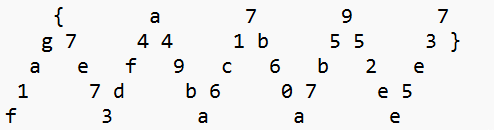

| Cipher                                                                  | <div style="width:100px">中文 </div>   | 密文                                                                                                                                                                                                         | <div style="width:290px">有 Key</div>        | 明文                                                           | Link                                                                                                  |
| ----------------------------------------------------------------------- | -------------------------------------- | ------------------------------------------------------------------------------------------------------------------------------------------------------------------------------------------------------------ | -------------------------------------------- | -------------------------------------------------------------- | ----------------------------------------------------------------------------------------------------- |
| [Playfair Cipher](http://www.atoolbox.net/Tool.php?Id=912)              |                                        | lqbfyngugulqbfimui                                                                                                                                                                                           | 789654                                       | flagthisisflaggood                                             |
| Columnar Transposition Cipher                                           | 列位移密码                             | ORUPELKCB                                                                                                                                                                                                    | CAP                                          | POKERCLUB                                                      |                                                                                                       |
| Piet                                                                    |                                        |                                                                                                                                                                                                              |                                              |                                    | [Link](https://www.bertnase.de/npiet/npiet-execute.php)                                               |
| BrainFuck/Brainloller                                                   |                                        |                                                                                                                                                                                                              |                                              |                             | bftools.exe decode brainloller 1.png --output 1.txt                                                   |
| Chicken                                                                 |                                        |                                                                                                                                                                                                              |                                              | Chicken Chicken Chicken Chicken                                | [link](https://kyrita.top/%E5%A6%82%E4%BD%95%E4%BC%98%E9%9B%85%E5%9C%B0%E8%BE%93%E5%87%BAHelloWorld/) |
| Dragon Language                                                         | 老滚 5 龙语                            |                                                                                                                                                                                                              |                                              |                       |                                                                                                       |
| [尊嘟假嘟](https://zdjd.vercel.app/)                                    |                                        | ÖvO O.O Ö.0 0_o o.Ö O.O o.o                                                                                                                                                                                  |                                              | Hello                                                          | [尊嘟假嘟翻译器 O.o](https://zdjd.vercel.app/)                                                        |
| [熊曰](http://hi.pcmoe.net/)                                            |                                        | 呋會呆果嗥樣偶圖歡嗥現嗒擊嗅嗒吃動沒告                                                                                                                                                                       |
| Fernet                                                                  |                                        | <div style="width:290px">32 长度 key `Erj5UoZfpxT47Bjpg8qg1XmMCKZyKBj1bJ0otszVZPk=`<br />密文: `gAAAAABlDt1jwPaAzErpXOaoA2g2UNOB61XEeNcjDUixY0Xs1B7MDiiNzKxQtx3Pvvsqed97WqMCZbKO-0de1GI0ZG8EgnXo4A==` </div> |                                              | flag{123}<br />特点 gAAAA                                      |                                                                                                       |
| The Shadow                                                              | [夏多密码](#夏多密码)  | ①②③ 还有时间 6:00:04                                                                                                                                                                                         |
| [日期表密码](#日期表密码)                                               |                                        | 1 2 3 8 15 16 17 22 29 30<br> 9 10 11 17 24 31                                                                                                                                                               |                                              |  |
| 易经 八卦                                                               |                                        |                                                                                                                                                                                                              |                                              |                     |
| 银河码表                                                                | 银河码表                               |                                                                                                                                                                                                              |                                              |   |
| [花朵密码](https://www.qqxiuzi.cn/bianma/wenbenjiami.php?s=huaduo)      |                                        | ❀❁❀❇❀✼❀❂✿❆✿✿❀❀✿✾✿✿✿❈=                                                                                                                                                                                        |                                              |
| [四方密码](https://blog.csdn.net/qq_45628145/article/details/106358102) |                                        | zhnjinhoopcfcuktlj <br>                                                                                                                                                                                      | key1 = 'information'<br>key2 = 'engineering' | youngandsuccessful                                             |
| [Rail Fences M 型栅栏密码](#rail-fences-m-%E5%9E%8B%E6%A0%85%E6%A0%8F)  |                                        | {bc1bg572ec066}a0d2fb137l951b5451f06b7                                                                                                                                                                       |                                              |                                                                | [Link](https://blog.csdn.net/Kuluha/article/details/133822735)                                        |
| Nonogram                                                                | 数织                                   |                                                                                                                                                                                                              |                                              |                  |                                                                                                       |

## 十二宫杀手密码


## 夏多密码


| 图示码 | 操作             |
| ------ | ---------------- |
| 1      | 密码表不旋转     |
| 2      | 密码表逆时针旋转 |
| 3      | 180 度旋转       |
| 4      | 顺时针旋转       |


`I AM IN DANGER SEND HELP`

以时间举例


所有 ① 的时间提取出来。看时针为 6, 则密码旋转 180 度。

```
① 6:00:04;
② 3:00:02;9:00:06;
③ 4:30:03;7: 30:05;
④ 1:30:01;7:30:05;10:30:07;
⑤ 1:30:01;4:30:03;7:30:05;10:30:07;
⑥ 3:00:02;
⑦ 7:30:05;10:30:07;
⑧ 3:00:02;6:00:04;
⑨ 1:30:01;7:30:05;10:30:07;
⑩ 1:30:01;
⑪ 1:30:01;4:30:03;7:30:05;10:30:07;
⑫ 12:00:08;
⑬ 7:30:05;10:30:07;
⑭ 1:30:01;
⑮ 3:00:02;7:30:05;10:30:07;
```

只看时针，画出对应时钟角度，写出密码


前 4 位为 `HAV`

## Rail Fences M 型栅栏



Cyberchef Rail Fences Decode

密文: `{a797g7441b553}aef9c6b2el7db607e5f3aae`

明文: `flag{7e73df4a49ba6c17b60a7b5952ee5e37}`

横向摆放 key, 参数: key5 offset 4

要从左下往中间数 4 个。就是 offset 4。key 暴一下出。
