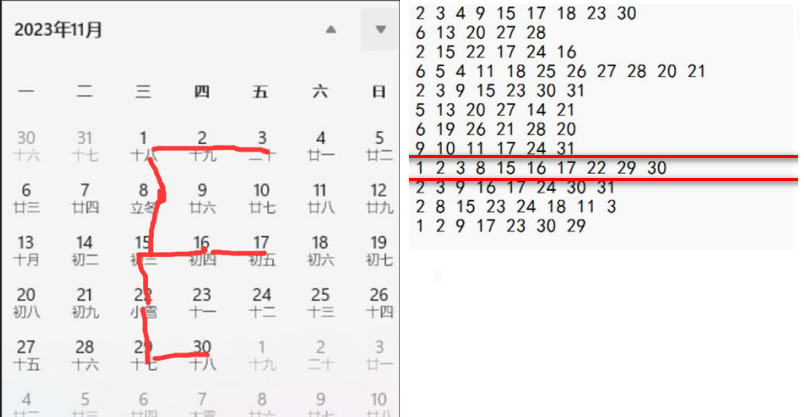
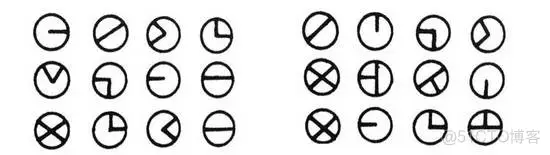
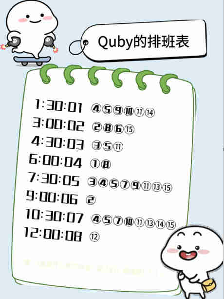
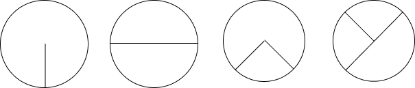

| Cipher                        | 中文                                   | 密文                                                                                                                                                                         | 有 Key | 明文                                                           | Link                                                                                                  |
| ----------------------------- | -------------------------------------- | ---------------------------------------------------------------------------------------------------------------------------------------------------------------------------- | ------ | -------------------------------------------------------------- | ----------------------------------------------------------------------------------------------------- |
| Columnar Transposition Cipher | 列位移密码                             | ORUPELKCB                                                                                                                                                                    | CAP    | POKERCLUB                                                      |                                                                                                       |
| Piet                          |                                        |                                                                                                                                                                              |        |                                    | [Link](https://www.bertnase.de/npiet/npiet-execute.php)                                               |
| BrainFuck/Brainloller         |                                        |                                                                                                                                                                              |        |                             | bftools.exe decode brainloller 1.png --output 1.txt                                                   |
| Chicken                       |                                        |                                                                                                                                                                              |        | Chicken Chicken Chicken Chicken                                | [link](https://kyrita.top/%E5%A6%82%E4%BD%95%E4%BC%98%E9%9B%85%E5%9C%B0%E8%BE%93%E5%87%BAHelloWorld/) |
| Dragon Language               | 老滚 5 龙语                            |                                                                                                                                                                              |        |                       |                                                                                                       |
| 尊嘟假嘟                      |                                        | ÖvO O.O Ö.0 0_o o.Ö O.O o.o                                                                                                                                                  |        | Hello                                                          | [尊嘟假嘟翻译器 O.o](https://zdjd.vercel.app/)                                                        |
| Fernet                        |                                        | 32 长度 key `Erj5UoZfpxT47Bjpg8qg1XmMCKZyKBj1bJ0otszVZPk=`<br />密文: `gAAAAABlDt1jwPaAzErpXOaoA2g2UNOB61XEeNcjDUixY0Xs1B7MDiiNzKxQtx3Pvvsqed97WqMCZbKO-0de1GI0ZG8EgnXo4A==` |        | flag{123}<br />特点 gAAAA                                      |                                                                                                       |
| The Shadow                    | [夏多密码](#夏多密码)  | ①②③ 还有时间 6:00:04                                                                                                                                                         |
| [日期表密码](#日期表密码)     |                                        | 1 2 3 8 15 16 17 22 29 30<br> 9 10 11 17 24 31                                                                                                                               |        |  |

## 十二宫杀手密码


## 夏多密码


| 图示码 | 操作             |
| ------ | ---------------- |
| 1      | 密码表不旋转     |
| 2      | 密码表逆时针旋转 |
| 3      | 180 度旋转       |
| 4      | 顺时针旋转       |



`I AM IN DANGER SEND HELP`

以时间举例



所有 ① 的时间提取出来。看时针为 6, 则密码旋转 180 度。

```
① 6:00:04;
② 3:00:02;9:00:06;
③ 4:30:03;7: 30:05;
④ 1:30:01;7:30:05;10:30:07;
⑤ 1:30:01;4:30:03;7:30:05;10:30:07;
⑥ 3:00:02;
⑦ 7:30:05;10:30:07;
⑧ 3:00:02;6:00:04;
⑨ 1:30:01;7:30:05;10:30:07;
⑩ 1:30:01;
⑪ 1:30:01;4:30:03;7:30:05;10:30:07;
⑫ 12:00:08;
⑬ 7:30:05;10:30:07;
⑭ 1:30:01;
⑮ 3:00:02;7:30:05;10:30:07;
```

只看时针，画出对应时钟角度，写出密码



前 4 位为 `HAV`
