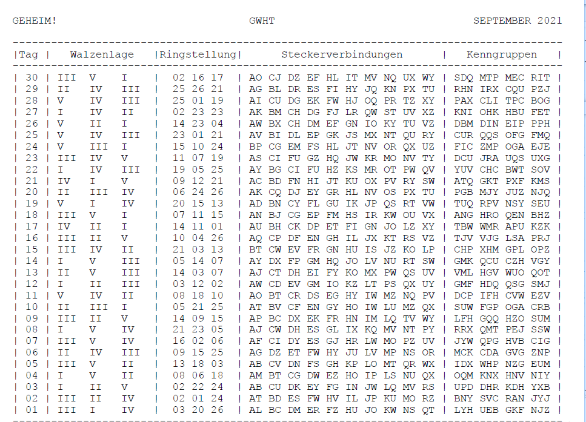
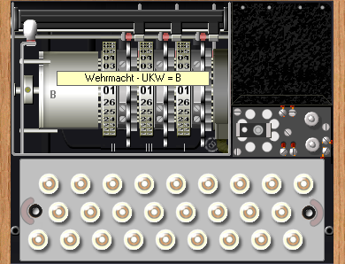
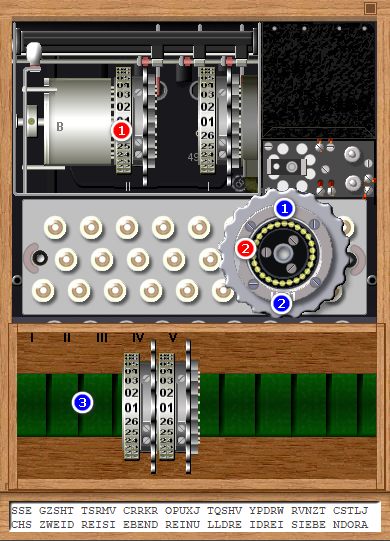
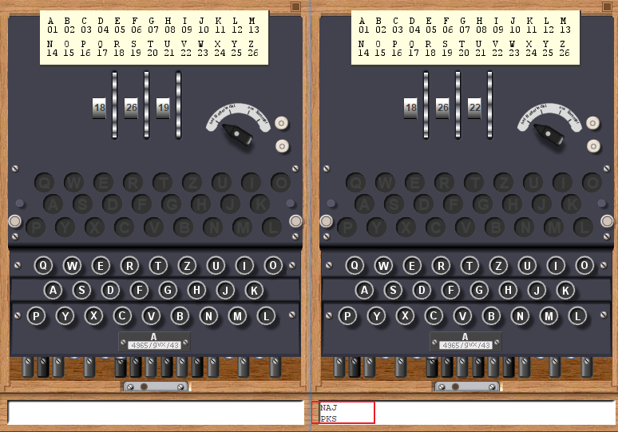

# 羊城杯2021 writeup

[首发！2021年羊城杯官方Writeup公布（Web）](https://mp.weixin.qq.com/s/BqLTX3au1GIPn3cz9xZISA)
[2021年羊城杯官方Writeup公布（Pwn）](https://mp.weixin.qq.com/s/I9S-C7vlgGJKd0dtApJXtA)
[2021年羊城杯官方Writeup公布（Crypto）](https://mp.weixin.qq.com/s/abS7vxi1eODfPgbuLh4aHA)
[2021年羊城杯官方Writeup公布（Reverse）](https://mp.weixin.qq.com/s/f06bifwP9w1dJX5_yPXhIw)
[2021年羊城杯官方Writeup公布（Misc）](https://mp.weixin.qq.com/s/ps1pscS1_CJib0qrgrAnnQ)

## 赛博德国人

得到 cookbook.pdf，搜一下walzenlage，发现是enigma密码。

[模拟器](http://enigmamuseum.com/EnigmaSim.zip)



```
#encrypted.txt
0911 = 1tle = 1tl = 350 = RZS NAJ=
nkfgp roqad boprv yrdhy zwamf qsrhb owqvt jzotr ffcjq snpqh kpwzm fprru gufez xsuws aohyw xbreu pifbz kagxj blbha jzixj zrasn zxkay lpaza ejwou itcip dfdgp rbjnv xuqzq qhtya xwwik wyybx kdgrc slrkj pgjay aidwa jeszp pbqat njojg jrplb kkhot joqpg vwecj soabm aupsr fenug ybxmr jloch kmjgc tznxl tnrqx pbeph fwymn gpoor pjkkb plkwb kxzeq quorp ipuvs utyae qyzgp mqnai iysse gzsht tsrmv crrkr opuxj tqshv ypdrw rvnzt cstlj 

0911 猜测为接受到信息的日期  
1tle 总共1部分
1tl 第1部分
350 为密文长度为350位
RZS NAJ 为加密转子起始位置解密信号
nkfgp 是2位随机加后3位标志位，去密码表里找到是 TAG为10的密码行
```


### 方式1 - 模拟器解码

1. 打开盖子，设置为B型机器 。
   

1. 使用2，3，1号转轮，分别调整到05 21 25

通过红色位置点击更换转轮，通过蓝色位置点击切换轮盘号码切换为05 ，21， 25。
 

3.盖上盖。调到RZS(对应的数字)输入 NAJ。输出为PKS



4.把PKS作为轮子起始值，进行解密。输入密文。并去掉前五位。即

```
roqad boprv yrdhy zwamf qsrhb owqvt jzotr ffcjq snpqh kpwzm fprru gufez xsuws aohyw xbreu pifbz kagxj blbha jzixj zrasn zxkay lpaza ejwou itcip dfdgp rbjnv xuqzq qhtya xwwik wyybx kdgrc slrkj pgjay aidwa jeszp pbqat njojg jrplb kkhot joqpg vwecj soabm aupsr fenug ybxmr jloch kmjgc tznxl tnrqx pbeph fwymn gpoor pjkkb plkwb kxzeq quorp ipuvs utyae qyzgp mqnai iysse gzsht tsrmv crrkr opuxj tqshv ypdrw rvnzt cstlj 
```

得到

```
VIERSIEBENFUENFSIEBENVIERACHTFUENFVIERSIEBENBERTADREISECHSSECHSZWEIDREINEUNDREISECHSDREISIEBENDREIZWEIDREINULLDREIFUENFSECHSSECHSSECHSFUENFDREISIEBENDREIFUENFDREISIEBENDREINEUNDREIFUENFSECHSSECHSDREIEINSDREINULLDREIVIERDREIACHTDREIFUENFDREISIEBENDREIEINSSECHSDREISECHSSECHSDREIVIERSECHSDREISECHSSECHSSECHSZWEIDREISIEBENDREINULLDREIDREISIEBENDORA
```

都是德文字母。解码一下


```python
from binascii import unhexlify

words = [
    ("0","NULL"),
    ("1","EINS"),
    ("2","ZWEI"),
    ("3","DREI"),
    ("4","VIER"),
    ("5","FÜNF"),
    ("6","SECHS"),
    ("7","SIEBEN"),
    ("8","ACHT"),
    ("9","NEUN"),
    ('A',"ZEHN"),
    ('B',"ELF"),
    ('C',"ZWÖLF"),
    ('E',"VIERZEHN"),
    ('F',"FÜNFZEHN"),
    ("D","DORA"),
    ("5","FUENF"),
    ("B","BERTA"),
]
enc = """VIERSIEBENFUENFSIEBENVIERACHTFUENFVIERSIEBENBERTADREISECHSSECHSZWEIDREINEUNDREISECHSDREISIEBENDREIZWEIDREINULLDREIFUENFSECHSSECHSSECHSFUENFDREISIEBENDREIFUENFDREISIEBENDREINEUNDREIFUENFSECHSSECHSDREIEINSDREINULLDREIVIERDREIACHTDREIFUENFDREISIEBENDREIEINSSECHSDREISECHSSECHSDREIVIERSECHSDREISECHSSECHSSECHSZWEIDREISIEBENDREINULLDREIDREISIEBENDORA"""

for k,v in words:
    enc = enc.replace(v, str(k))
print(enc)
print(unhexlify(enc))
```


### 方式2 - pycipher

全部使用python解码。


```python
from pycipher import Enigma

from string import ascii_uppercase as letter

a, b, c = letter[5 - 1], letter[21 - 1], letter[25 - 1] # 对应ringstellung的05,21,25, 从0开始所以-1
enigma = Enigma(settings=('R', 'Z', 'S'), rotors=(2, 3, 1), reflector='B', ringstellung=(a, b, c), steckers=[('A', 'T'), ('B', 'V'), ('C', 'F'), ('E', 'N'), ('G', 'Y'), ('H', 'O'), ('I', 'W'), ('L', 'U'), ('M', 'Z'), ('Q', 'X')])
walzenlage = enigma.decipher('NAJ')
print(walzenlage)

enigma.settings = list(walzenlage)
print(enigma.decipher('roqadboprvyrdhyzwamfqsrhbowqvtjzotrffcjqsnpqhkpwzmfprrugufezxsuwsaohywxbreupifbzkagxjblbhajzixjzrasnzxkaylpazaejwouitcipdfdgprbjnvxuqzqqhtyaxwwikwyybxkdgrcslrkjpgjayaidwajeszppbqatnjojgjrplbkkhotjoqpgvwecjsoabmaupsrfenugybxmrjlochkmjgctznxltnrqxpbephfwymngpoorpjkkbplkwbkxzeqquorpipuvsutyaeqyzgpmqnaiiyssegzshttsrmvcrrkropuxjtqshvypdrwrvnztcstlj'))

```


## 缤纷

```python
import os
import random
import itertools
from alive_progress import alive_bar
import colorsys
import pyzbar.pyzbar as pyzbar
from PIL import Image

analysis = {}


# 观察发现二维码的文件名由两部分组成，前一部分是ascii字符的十六进制，后一部分是序号
# 第一步分析二维码文件名得到hint1，并得到二维码的正确顺序
def step1():
    global analysis
    hint1 = ""
    current_dir = os.path.abspath(__file__).replace("solve.py", "")
    allpngfiles = []
    for dirpath, dirnames, filenames in os.walk(f"{current_dir}pics"):
        for f in filenames:
            if f.endswith(".png"):
                allpngfiles.append(os.path.join(dirpath, f))
    for f in allpngfiles:
        index = f.replace(".png", "")[-3:]
        analysis[int(index)] = f
    analysis = sorted(analysis.items(), key=lambda x: x[0], reverse=False)
    for png in analysis:
        hint1 += chr(int(png[1].split("\\")[-1][:-7]))
    print(hint1)
    # 在第一步得到正确顺序的基础上，解析二维码内容得到hint2,确认颜色和01之间的关系


def step2():
    hint2 = ""
    for png in analysis:
        img = Image.open(png[1])
        hint2 += pyzbar.decode(img)[0].data.decode("utf-8")
    print(hint2)
    # 在第一部得到正确顺序的基础上，解析二维码颜色值转换成对应的01数据


def step3():
    randnumbers = ""
    color_to_01_from_hint2 = {
        (255, 0, 0): "0",
        (0, 0, 255): "1",
        (0, 128, 0): "0",
        (255, 255, 0): "1"
    }

    for png in analysis:
        image = Image.open(png[1])
        image = image.convert('RGBA')
        max_score = 0
        dominant_color = None
        for count, (r, g, b, a) in image.getcolors(image.size[0] * image.size[1]):
            # 跳过纯黑色
            if a == 0:
                continue
            saturation = colorsys.rgb_to_hsv(r / 255.0, g / 255.0,
                                             b / 255.0)[1]
            y = min(
                abs(r * 2104 + g * 4130 + b * 802 + 4096 + 131072) >> 13, 235)
            y = (y - 16.0) / (235 - 16)
            # 忽略高亮色
            if y > 0.9:
                continue
            score = (saturation + 0.1) * count
            if score > max_score:
                max_score = score
                dominant_color = (r, g, b)
                randnumbers += color_to_01_from_hint2[dominant_color]
            randnumbers = [
                chr(int("".join(randnumbers[i:i + 6]), 2))
                for i in range(0, len(randnumbers), 6)
            ]
            print("".join(randnumbers))


# 第三步得到三个随机数种子，由hint1得到随机数种子为8位数字，确定爆破范围
def step4():
    maybelist = list(itertools.permutations(list("0123456789"), 8))
    maybelist = ["".join([str(i) for i in j]) for j in maybelist]

    with alive_bar(len(maybelist)) as bar:
        for i in maybelist:
            bar()
            random.seed(int(i))
            if random.uniform(0.2, 0.8) == 0.4290974099316922:
                pass
            else:
                continue
            if random.uniform(0.2, 0.8) == 0.4944769485723323:
                pass
            else:
                continue
            if random.uniform(0.2, 0.8) == 0.5867437859394381:
                print("\nflag is :{}".format(str(i)))
                exit()
            else:
                continue


if __name__ == "__main__":
    step1()
    step2()
    step3()
    step4()
```